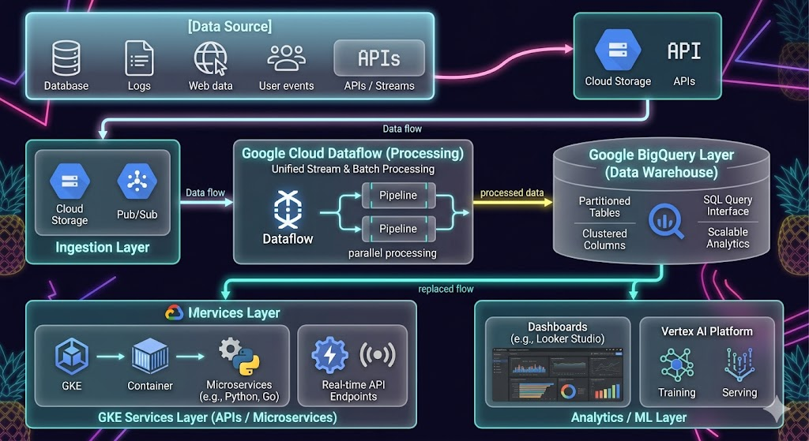

# Enterprise GCP Data Platform Architecture  
(BigQuery + Dataflow + GKE)

---

## Overview

This project presents an enterprise-grade, cloud-native data platform built on Google Cloud Platform (GCP), designed to support high-volume data ingestion, real-time and batch processing, scalable analytics, and AI-driven workloads.

The architecture focuses on **scalability, cost efficiency, fault tolerance, and minimal operational overhead**, aligning with modern data platform principles.

---

## Architectural Principles

- **Serverless-first design** (reduce operational burden)
- **Decoupled architecture** (independent scaling of components)
- **Event-driven processing** (real-time capabilities)
- **Elastic scalability** (auto-scaling services)
- **Security & governance by design**

---

## High-Level Architecture

### 1. Ingestion Layer
- Cloud Storage (batch ingestion)
- Streaming sources (Pub/Sub or APIs)

### 2. Processing Layer
- **Dataflow (Apache Beam)**
  - Handles both batch and streaming pipelines
  - Auto-scales based on workload
  - Supports windowing and fault tolerance

### 3. Storage & Analytics Layer
- **BigQuery**
  - Columnar storage for analytical queries
  - Partitioning & clustering for performance optimization
  - Serverless architecture eliminates infrastructure overhead

### 4. Compute / Service Layer
- **GKE (Google Kubernetes Engine)**
  - Hosts microservices and APIs
  - Handles transformation services and business logic
  - Enables flexible deployment and scaling

### 5. Consumption Layer
- BI tools (Power BI / Tableau)
- ML pipelines (Vertex AI integration)

---

## Architecture Diagram

---

## Key Architectural Decisions

### BigQuery as Analytical Engine
- Selected for **serverless scalability**
- Eliminates need for cluster management
- Supports large-scale analytical queries efficiently

### Dataflow for Unified Processing
- Chosen over Spark for:
  - Fully managed service
  - Native GCP integration
  - Reduced operational complexity
- Supports both streaming and batch workloads

### GKE for Orchestration
- Selected over Cloud Run for:
  - Greater control over deployment
  - Support for long-running workloads
  - Advanced networking and scaling capabilities

---

## Trade-Off Analysis

| Decision Area | Option Chosen | Alternative | Reason |
|-------------|--------------|------------|--------|
| Data Warehouse | BigQuery | Snowflake | Native integration + serverless |
| Processing | Dataflow | Spark | Managed service, less overhead |
| Compute | GKE | Cloud Run | Better control & flexibility |

---

## Scalability Strategy

- Auto-scaling via Dataflow pipelines
- BigQuery handles elastic query scaling
- Kubernetes horizontal scaling in GKE
- Partitioning strategies for large datasets

---

## Cost Optimization Approach

- Serverless architecture reduces idle resource costs
- BigQuery partitioning & clustering reduces query cost
- Dataflow auto-scaling minimizes compute waste

---

## Security & Governance

- IAM-based access control
- Role-based permissions across services
- Data encryption at rest and in transit
- Integration with enterprise governance policies

---

## Outcome

- Designed a **highly scalable, fault-tolerant data platform**
- Reduced operational overhead through managed services
- Enabled real-time and batch analytics on a unified platform
- Achieved cost-efficient, performance-optimized architecture
